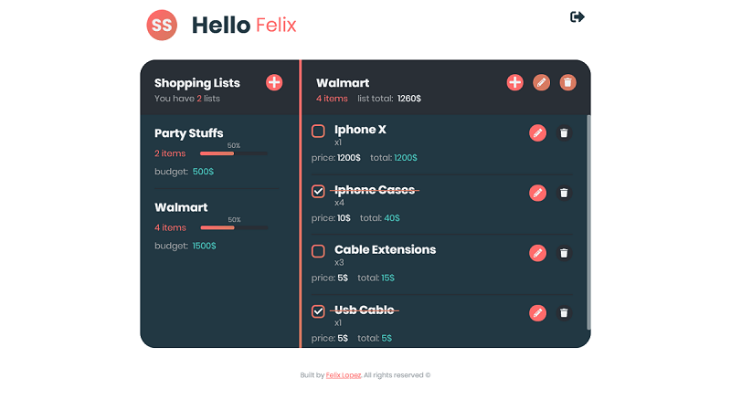

# Supper Shopping list app

this is my first full stack web application i developed, is a basic app, where you can login and add as many shopping lists as you want and add items to them, I built this app from scratch including the UI design, you can see it [here](https://www.figma.com/file/tj2xEHtrz8av6EIQCN3adD/super-shopping-list?node-id=0%3A1), and it uses the MERN stack, redux, styled components and jwt for authentication.

The goal for me was to create something for using while doing my shoppings, because i have to go to severals places to save a litte bit of money.

Feel free to contribute to this project there is still to do the password recovery implementation

# [Live Demo](https://ssl.felixlopez.tech)



## Installation and Configuration

### Backend (Node, Express)

Add your database connection to an eviroment variable named `MONGO_URI` and a jwt secret named `jwtSecret` in a `.env` file at backend directory, example in .env.sample.

this API is configured to use netlify serverless lambda functions, you can se more info about the configuration watching this [video](https://www.youtube.com/watch?v=hQAu0YEIF0g)

```sh
  git clone https://github.com/felixlopz/react-super-shopping-list.git
  cd backend
  npm install
```

#### Available commands

```sh
  npm run start # runs development server with netlify-lambda on port 9000 
  npm run build # builds the application on dist folder
```

### Client (React App)

This client uses a global API url, if you have deployed the backend you can use that url setting up an eviroment variable named `REACT_APP_API` in a `.env` file at client directory, example in `.env.sample`.

Theres is file named `API.js` at `src` directory where you can set your api url, take in concideration the following fetch url ``` fetch(`${URL}/api/user/shopping`)```

```sh
  git clone https://github.com/felixlopz/react-super-shopping-list.git
  cd client
  npm install
```


